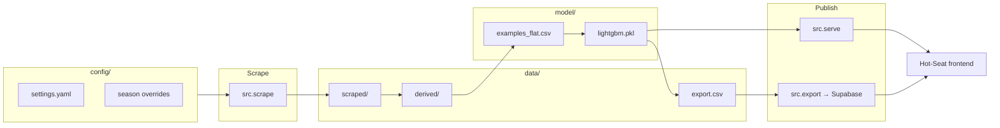

# Hot Seat Backend

Backend for [Hot Seat](https://hot-seat.netlify.app) — a model and data pipeline that estimates NFL head-coach firing probability from Pro-Football-Reference history, Vegas odds, and tenure/context features.

LightGBM scores each coach-season. Results are published to Supabase for the frontend and exposed through a FastAPI predict service for What-If scenarios.

**Related repo:** [Hot-Seat](https://github.com/NFordUMass/Hot-Seat) (Netlify frontend)

## Architecture



## Quick start

```bash
python -m venv .venv && source .venv/bin/activate
pip install -r requirements.txt
cp .env.example .env   # add Supabase credentials for export
```

Run from the **repo root**.

### Full pipeline

```bash
python -m src.scrape all          # refresh scraped caches + derived pivots
python -m src.score               # train LightGBM, write data/export.csv
python -m src.export              # upsert to Supabase coach_year_v2
```

Fast iteration when caches and model artifacts are already built:

```bash
python -m src.score --skip-train
python -m src.export
```

### Predict API (local)

```bash
pip install -r requirements-serve.txt
uvicorn src.serve:app --reload --port 8000
```

- `GET /health` — model metadata and feature list
- `POST /predict` — `{ "named_features": { ... } }` (preferred) or `{ "features": [ ... ] }`

The What-If UI sends **54 LightGBM feature names** (e.g. `age_t0`, `win_pct_t0`, `exp`, `prehire_round_1`). See `GET /health` for the full list.

## Repository layout

```
config/                 Human-edited sources of truth
  settings.yaml         Active season, history_end, games per season
  teams.csv, team_colors.csv, abbrev_aliases.yaml, …
  <season>/             Per-year firings, hires, futures, win totals

data/
  scraped/              Cached PFR / odds pulls (regenerable)
  derived/                Pivots and joins used by the model
  export.csv              Display table for Supabase + frontend

model/
  examples_flat.csv       Last-k flattened training examples
  lightgbm.pkl            Production classifier (score + serve)
  lightgbm_oof.csv        Out-of-fold probabilities for historical rows
  training.csv            Display-feature table for export assembly

src/
  scrape.py               Scrape CLI (index, coaches, odds, standings, coy, teams)
  training.py             Build model/training.csv display features
  examples.py             Build model/examples_flat.csv for LightGBM
  fit.py                  Train LightGBM (GroupKFold OOF + final model)
  score.py                Score coaches, write data/export.csv
  export.py               Upsert export → Supabase
  serve.py                FastAPI /predict for What-If
  fetch.py, cache.py, season.py, reference.py, predict.py

supabase/coach_year_v2.sql   Table DDL (run once in Supabase SQL editor)
render.yaml                  Render deploy for src.serve
```

| Layer | Contents | Updated by |
|-------|----------|------------|
| `config/` | Season knobs, firings, hires, futures | Manual edits |
| `data/scraped/` | Raw web caches | `python -m src.scrape` |
| `data/derived/` | Feature pivots | Scrape derive step / pipeline |
| `data/export.csv` | Published coach-season rows | `python -m src.score` |
| `model/` | Training artifacts + fitted model | `src.examples`, `src.fit`, `src.score` |

## Scrape CLI

```bash
python -m src.scrape index                 # data/scraped/coaches.csv
python -m src.scrape coaches               # active coaches through history_end
python -m src.scrape coaches --id ReidAn0 --fetch
python -m src.scrape odds                  # O/U tables through history_end
python -m src.scrape standings --year 2025 --fetch
python -m src.scrape coy --year 2025 --fetch
python -m src.scrape teams --year 2025 --fetch
python -m src.scrape ingest-coaches        # bulk import coaches_raw → coaches/
python -m src.scrape all                   # index + coaches + odds + standings + coy + teams
python -m src.scrape all --fetch           # force re-download
```

Cached files are reused unless you pass `--fetch`. HTTP uses `curl_cffi` (Chrome impersonation) when available, else `requests` with a browser user-agent.

**Cloudflare / 403 workaround:** save the page in your browser and pass `--html`, or set `PFR_COOKIE` in `.env`:

```bash
python -m src.scrape index --html coaches.htm
export PFR_COOKIE='...'
```

## Model training

The production model is a **LightGBM classifier** on last-`k` flattened coach-stop sequences (default `k=5`).

```bash
python -m src.examples              # model/examples_flat.csv
python -m src.fit                   # model/lightgbm.pkl + OOF metrics
python -m src.fit --rebuild-examples --k 5 --folds 5
```

`python -m src.score` runs examples + fit automatically unless `--skip-train` is passed.

Metrics from the latest CV run live in `model/lightgbm_metrics.json`.

## Deploy predict API (Render)

1. Push `src/serve.py`, `requirements-serve.txt`, `render.yaml`, and `model/lightgbm.pkl`.
2. [Render](https://dashboard.render.com) → **New → Blueprint** → connect this repo → apply `render.yaml`.

Or create a web service manually:

| Setting | Value |
|---------|--------|
| Build | `pip install -r requirements-serve.txt` |
| Start | `uvicorn src.serve:app --host 0.0.0.0 --port $PORT` |
| Health check | `/health` |

After retraining, commit the new `model/lightgbm.pkl` and redeploy so batch scores and What-If stay aligned.

**Note:** Render free tier spins down when idle; first request after sleep is slow. The serve image intentionally uses `requirements-serve.txt` only (no scrape/train deps).

## Supabase export

1. Run `supabase/coach_year_v2.sql` once in the Supabase SQL editor.
2. Set `SUPABASE_URL` and `SUPABASE_SERVICE_ROLE` in `.env` (see `.env.example`).
3. `python -m src.export`

## Rolling to a new season

Example: predicting **2027** after **2026** completes.

1. Create `config/2027/` with `firings.yaml`, `hires.yaml`, `sb_futures.csv`, `wins_exp.csv`.
2. Update `config/settings.yaml`:

   ```yaml
   season: 2027
   history_end: 2026
   games: 17
   ```

3. Refresh data and republish:

   ```bash
   python -m src.scrape all --fetch
   python -m src.score
   python -m src.export
   ```

See `config/2026/README.md` for a season-folder template.

## Data in git

This repo commits scraped caches (`data/scraped/`, ~2k files) so the pipeline runs without a full re-scrape. You can regenerate everything from scratch with `python -m src.scrape all --fetch` if needed.

## Development

```bash
pip install -r requirements-dev.txt   # adds matplotlib, SHAP, Jupyter, etc.
```

## License

MIT — see [LICENSE](LICENSE).
